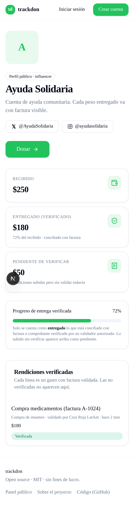
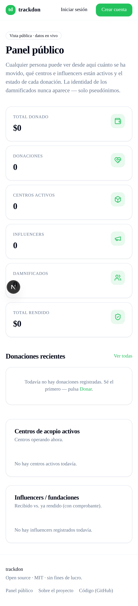
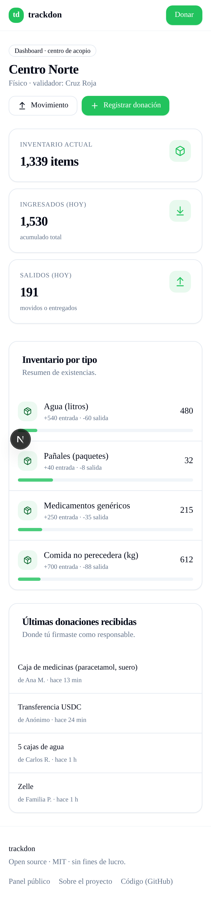
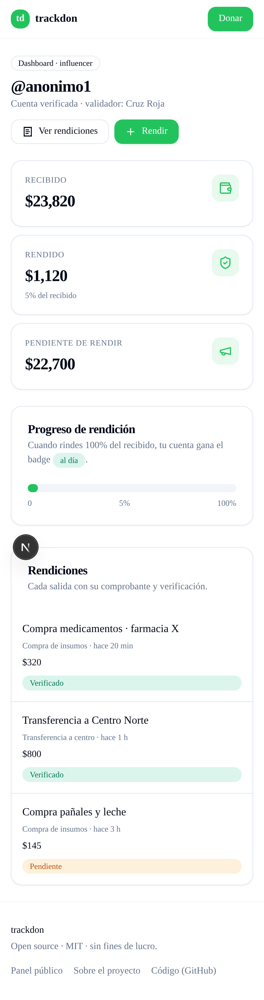

# trackdon

**Tracking de donaciones humanitarias. Mobile-first, open source, transparente.**

Aplicación web (responsive, pensada primero para teléfono) para que después
de una emergencia humanitaria toda la ayuda quede **centralizada y
trazable**: quién donó, qué centro la recibió, qué responsable la movió,
cómo terminó llegando al damnificado.

MIT. Sin venta, sin lucro — el código es público para que cualquier
organización pueda usarlo o auditarlo.

## Capturas

| Perfil público del influencer | Panel público |
|---|---|
|  |  |

| Dashboard centro de acopio | Dashboard influencer |
|---|---|
|  |  |

## El problema

Tras un evento mayor se activan muchos canales de recolección:

- Centros de acopio físicos reciben bienes (ropa, comida, medicinas).
- Influencers, fundaciones y wallets cripto reciben donaciones en dinero.
- Voluntarios compran medicamentos con esos fondos y los llevan a campo.

En la mayoría de casos **el rastro termina en el momento de la entrega
inicial**. La gente que donó no sabe si su caja llegó, los voluntarios no
pueden auditar el manejo, y siempre aparece alguien aprovechándose de la
urgencia para quedarse con recursos ajenos.

## La solución

> Centralizar toda la ayuda en un solo registro, dar transparencia
> hacia quien la maneja, proteger la dignidad de quien la recibe.

## No custodiamos fondos

trackdon es un **libro público de trazabilidad**, no un intermediario de
pagos. La gente dona directamente al centro o al influencer; aquí queda
el registro verificable de quién recibió qué y cómo terminó entregándose.

## Dashboards

Cada actor tiene su propio panel, con permisos estrictamente separados:

### Dashboard Centro de Acopio
- Inventario en tiempo real de lo recibido.
- Registro de cada donación entrante (donante, descripción, foto, valor
  estimado).
- Movimientos a otros centros o entregas a damnificados.
- Responsables internos del centro (quién firmó qué).

### Dashboard Influencer / Receptor cash
- Wallet o cuentas vinculadas (Zelle, USDC, bancos).
- Donaciones recibidas con su origen.
- **Rendición obligatoria**: cada salida de fondos debe tener un destino
  documentado — factura de compra de insumos, transferencia a un centro
  con su comprobante, etc.
- Saldo pendiente de rendir vs. saldo total recibido.

### Dashboard público
- Vista de solo lectura para cualquier persona.
- Totales por centro, por influencer, por categoría de ayuda.
- Búsqueda por ID de donación o por nombre del donante (si optó por
  hacerlo público).
- **Nunca expone identidad de damnificados**, solo agregados.

## Actores

| Actor | Qué hace |
|---|---|
| **Donante** | Registra su donación (bien físico o dinero). Recibe ID de tracking. Sigue el flujo en tiempo real. |
| **Centro de acopio** | Recibe bienes. Inventarea. Firma cada movimiento. |
| **Influencer / fundación cash** | Recibe dinero. Rinde cuentas con recibos y transferencias documentadas. |
| **Damnificado** | Pasa KYC (fase 2 con proveedor tercerizado). Aparece en padrón privado como pseudónimo. |
| **Validador autorizado** | Organización (Cruz Roja, alcaldías, ONGs) que atestigua damnificados y centros. |
| **Observador público** | Cualquiera con el link. Solo lectura, sin datos sensibles. |

## Principios

1. **Transparencia hacia quien maneja, dignidad para quien recibe.**
2. **Código abierto, datos privados.** El repo es público (MIT). El padrón
   KYC, las fotos y las facturas viven en Supabase con RLS estricta y nunca
   se commitean al repo.
3. **No custodia de fondos.** No recibimos ni distribuimos dinero. Solo
   registramos lo que pasa.
4. **Verificación obligatoria para entregado.** Una rendición no cuenta
   como "entregado" hasta que un validador autorizado revisa su comprobante.

## Stack

| Capa | Tecnología | Notas |
|---|---|---|
| Frontend / Dashboard | Next.js 16 (App Router, Turbopack) + React 19 + Tailwind + shadcn/ui | Mobile-first. Deploy en Vercel. |
| API | Next.js Route Handlers + Server Actions | Una sola codebase. |
| DB | Supabase (Postgres + RLS) | Fuente de verdad. RLS deny-all + policies explícitas. |
| Storage | Supabase Storage | Buckets `avatares`/`pruebas` públicos, `comprobantes`/`denuncias` privados con signed URLs. |
| Auth | Supabase Auth (OTP 6 dígitos) | Roles: `donante`, `centro_admin`, `centro_responsable`, `influencer`, `validador`, `super_admin`. |

## Seguridad

Ver [SECURITY.md](./SECURITY.md). Resumen:

- Supabase: `service_role` **solo server-side**, jamás expuesto al navegador.
- RLS por defecto **deny-all**, los reads se abren explícitamente.
- Anon key del navegador con scope mínimo (solo selects públicos).
- Archivos privados nunca con URLs públicas; signed URLs de corta vida.
- Sin secrets en el repo. `.env.example` solo nombra las variables.

## API REST de integración

trackdon expone una API REST autenticada con API keys para que sistemas
externos (otras plataformas de tracking, webhooks de pasarelas, planillas
internas de ONGs) puedan **registrar donaciones** en el libro público sin
pasar por la UI.

**Base URL:** `https://trackdonations.xyz/api/v1`

**Autenticación:** header `x-api-key: tk_xxxxxxxxxxx`
(o `Authorization: Bearer tk_xxxxxxxxxxx`).
Las keys se generan en `/admin/api` (solo `super_admin`).
La key plain se muestra una sola vez al crearla — en DB queda solo el
hash SHA-256.

**Scopes:**

| Scope | Permite |
|---|---|
| `read` | Lectura completa (atajo) |
| `read:cajas`, `read:donaciones`, `read:centros`, `read:influencers`, `read:eventos`, `read:rendiciones`, `read:feed` | Lectura específica |
| `write` | Escritura completa (otorgar con cuidado) |
| `write:donaciones`, `write:cajas` | Escritura específica |

**Protecciones:**

- Rate limit: 60 req/min lectura, 30 req/min escritura, por key.
- Body máximo: 200 KB.
- Validación de payload con `zod`.
- Idempotencia: `external_ref` único por API key → reenvíos no duplican.
- Log de cada request (`api_call_log`) con IP hasheada (sha256:16).
- Sin custodia de fondos. La API solo registra el evento; el dinero
  o los bienes viajan por fuera.

### Endpoints

| Método | Ruta | Scope | Descripción |
|---|---|---|---|
| GET | `/donaciones?limit=20&offset=0` | `read:donaciones` | Listado paginado |
| **POST** | `/donaciones` | `write:donaciones` | Registrar donación |
| GET | `/cajas?limit=20&estado=distribuida` | `read:cajas` | Listado de cajas |
| GET | `/centros?limit=20` | `read:centros` | Centros activos |
| GET | `/influencers?limit=20` | `read:influencers` | Influencers + métricas |
| GET | `/eventos?limit=20` | `read:eventos` | Eventos activos |

### POST /api/v1/donaciones — registrar una donación

```bash
curl -X POST https://trackdonations.xyz/api/v1/donaciones \
  -H "x-api-key: tk_xxxxxxxxxxx" \
  -H "Content-Type: application/json" \
  -d '{
    "tipo": "dinero_fiat",
    "descripcion": "Transferencia Zelle ref 8847",
    "valor_estimado_usd": 200,
    "evento_slug": "terremoto-venezuela-jun-2026",
    "influencer_slug": "fundacion-manos",
    "donante_username": "maria_r",
    "external_ref": "zelle-tx-8847",
    "estado": "recibida"
  }'
```

**Respuesta 201:**

```json
{
  "data": {
    "id": "uuid",
    "tipo": "dinero_fiat",
    "estado": "recibida",
    "valor_estimado_usd": 200,
    "creado_at": "2026-06-28T15:00:00Z",
    "external_ref": "zelle-tx-8847"
  }
}
```

**Reenvío con el mismo `external_ref`** devuelve 200 con `idempotent: true`
y el row original — no crea duplicado.

**Campos:**

- `tipo` (`bienes` | `dinero_fiat`) — obligatorio
- `descripcion` — obligatorio, 3-1000 chars
- `valor_estimado_usd` — número ≥ 0, opcional
- `evento_id` o `evento_slug` — opcional pero recomendado
- Receptor (obligatorio uno): `centro_id`, `centro_slug`, `influencer_id` o `influencer_slug`
- `donante_username` — opcional; si no existe en trackdon, queda anónima
- `external_ref` — opcional, identificador de tu sistema (recomendado para idempotencia)
- `estado` — `recibida` (default), `rendida_parcial`, `rendida_total`, `observada`

### Errores

| Código | Caso |
|---|---|
| 400 | JSON inválido o body > 200 KB |
| 401 | Key faltante o inválida |
| 403 | Falta scope requerido |
| 404 | `evento_slug` / `influencer_slug` / `centro_slug` no existe |
| 422 | Falló validación zod del payload |
| 429 | Rate limit excedido (header `retry-after: 60`) |
| 500 | Error interno (no expone stack) |

## Estado

**Alpha en producción.** trackdonations.xyz acepta donantes, centros e
influencers reales. Open source MIT.

## Cómo contribuir

Buscamos:

- **Next.js + Supabase** — dashboards mobile-first, RLS, roles, server actions.
- **Diseño / UX** — flujos mobile para donante, centro y damnificado.
- **Solana / Anchor** (fase 2) — programa de anclaje de eventos.
- **Legal / privacidad** — revisión de modelo de datos y separación
  código/datos.
- **Conexión con ONGs** — para validar el modelo con casos reales.

Abre un Issue con la etiqueta `propuesta` o un PR pequeño. Las
contribuciones públicas quedan atribuidas en `CONTRIBUTORS.md`.

## Licencia

MIT. Ver [LICENSE](./LICENSE).
